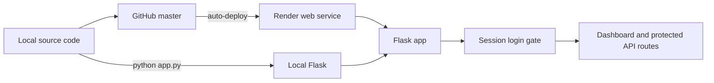
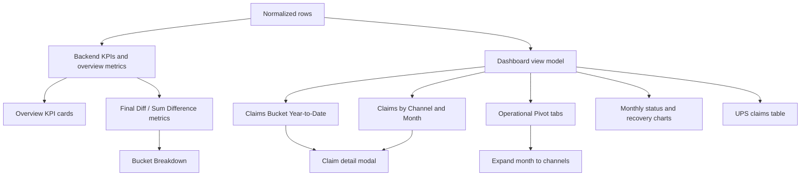

# Dashboard Architecture

This document describes the current production shape of the reconciliation dashboard. It is intentionally split into three diagrams so data flow, deployment, and screen behavior can be reviewed independently.

## 1. System and deployment



## 2. Data pipeline

```mermaid
flowchart LR
  SHEETS[(Google Sheets)] -->|read tabs| PARSE[sheets_service.py]
  PARSE -->|header mapping + normalization| MODEL[Normalized source models]
  MODEL -->|shared overview metrics| CACHE[Safe in-memory snapshot]
  CACHE --> API[/api/data]
  UI[Browser dashboard] -->|fetch| API
  UI -->|POST /api/update-row| WRITE[Google Sheets write-back]
  WRITE -->|refresh after write| CACHE
  CACHE --> HEALTH[Refresh age / partial errors / stale status]
```

The Excel-to-Google-Sheet sync remains a separate, manual upstream workflow. The dashboard does not run that sync.

## 3. Dashboard calculation and view mapping



## Refresh and reliability behavior

- Manual Refresh calls `/api/refresh` and then reloads `/api/data`.
- The browser refreshes automatically every 20 minutes.
- The backend keeps the last successful snapshot if a full refresh fails.
- `/api/data` reports refresh age, partial source errors, and stale status.
- A green/amber/red status indicator is shown in the dashboard header.
